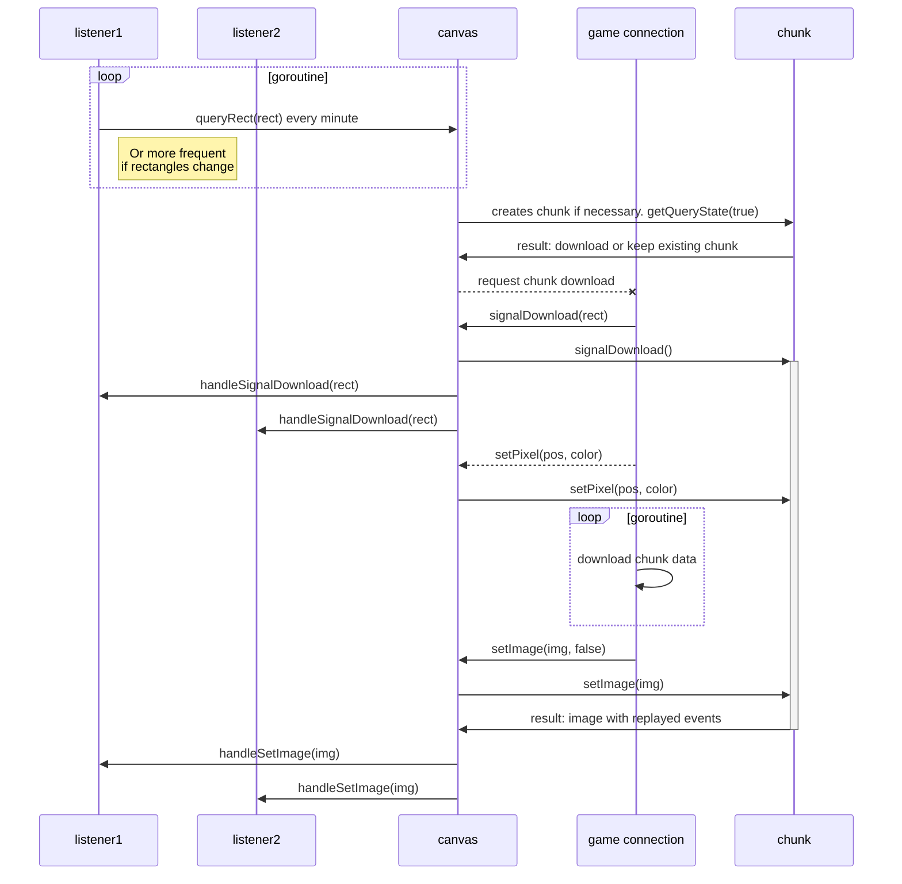

# D3pixelbot internal architecture

## Chunk download mechanism

The chunk download mechanism is basing on frequent requests from listeners.
Each request contains a rectangle that the canvas should try to keep in sync with the game.

Not queried chunks will get unloaded/deleted automatically after some time.

While a chunk is downloading, all pixel events will be queued.
After is has been downloaded, all events will be replayed.
This will make sure that the data will not get out of sync while chunk data is being downloaded.

