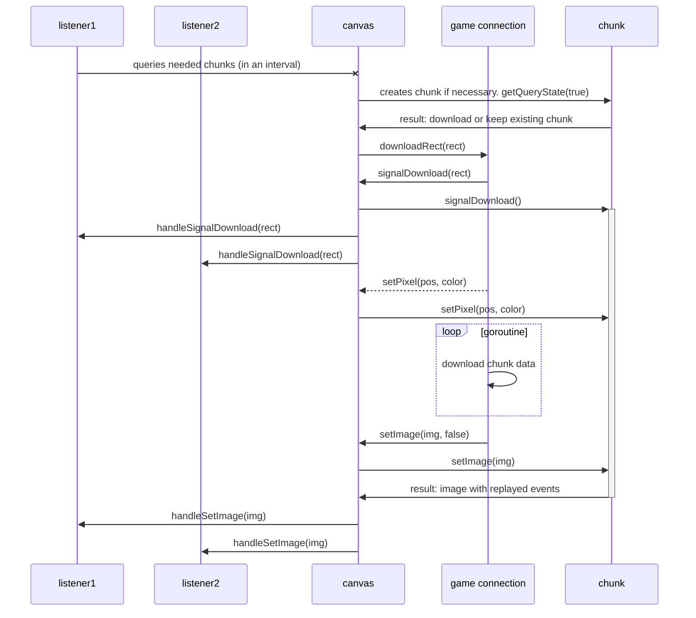

# D3pixelbot internal architecture

## Chunk download mechanism

```mermaid
sequenceDiagram
    participant listener1
    participant listener2
    participant canvas
    participant game connection
    participant chunk

    listener1 -x canvas: queries needed chunks (in an interval)
    canvas ->> chunk: creates chunk if necessary. getQueryState(true)
    chunk ->> canvas: result: download or keep existing chunk
    canvas ->> game connection: downloadRect(rect)
    game connection ->> canvas: signalDownload(rect)
    canvas ->> +chunk: signalDownload()
    canvas ->> listener1: handleSignalDownload(rect)
    canvas ->> listener2: handleSignalDownload(rect)
    game connection -->> canvas: setPixel(pos, color)
    canvas ->> chunk: setPixel(pos, color)
    loop goroutine
        game connection->>game connection: download chunk data
    end
    game connection ->> canvas: setImage(img, false)
    canvas ->> chunk: setImage(img)
    chunk ->> -canvas: result: image with replayed events
    canvas ->> listener1: handleSetImage(img)
    canvas ->> listener2: handleSetImage(img)
```