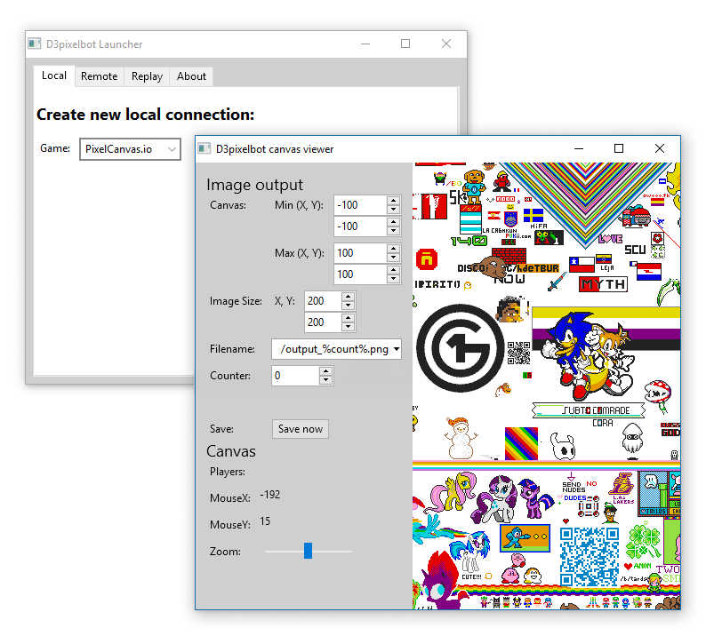
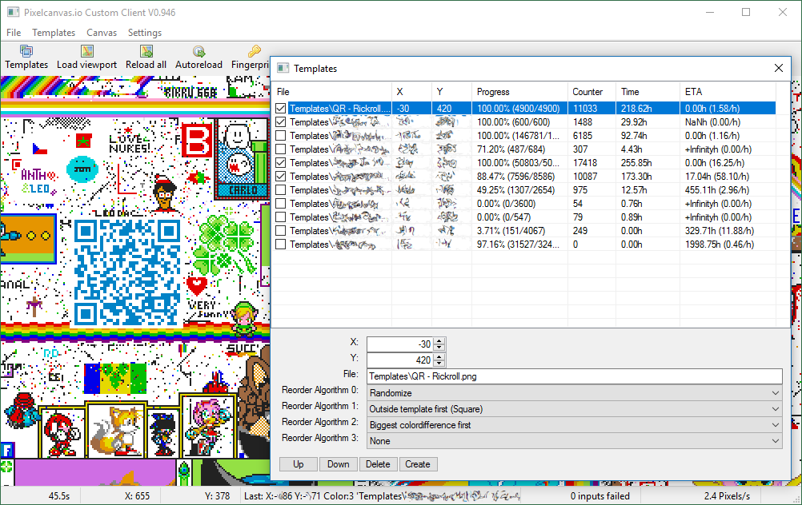

# D3pixelbot

This is a custom client, bot, recorder, timelapse creator and more for PixelCanvas.io and similar online games.
In contrast to similar projects this client is made to be configurable and usable without any hassles.
Programming experience isn't necessary, and there is no need to install runtimes for any scripting language.

## Current state

As the previous version stopped working when PixelCanvas.io moved to https, i decided to rewrite the complete project in go.
This means the program has less functions that before, at least until they are implemented.
On the other hand, rewriting it in go opens up a lot of possibilities.

Here is a list of implemented features or soon to be implemented things/ideas:

- [x] UI to control everything
- [ ] Nice looking UI to control everything
- [x] Reconnects, downloads and re-downloads automatically and as needed
- [x] View canvas as you can on the game's website
- [x] Record canvas events (Relatively compact: ~10-20 MB/day, can be reduced further later)
- [x] Play back recordings (Freely seekable)
- [x] Export image sequence from recordings (Subset of the recorded canvas, timelapses, ...)
- [x] Multitasking. You can run many game instances/tasks from a single application
- [x] Works on Windows, Linux and macOS (Latter two not tested yet)
- [ ] Place pixels manually
- [ ] Place pixels automatically, with given templates and strategies
- [ ] Remote connect and control
- [ ] Forward captcha requests to user (Solvable in the user interface, also with remote controlling)
- [ ] Option to run headless / As service
- [ ] No need for the user to retrieve fingerprints or anything from a browser
- [ ] Support for proxies and VPNs (Later, low priority)
- [ ] Support more games (It's relatively easy to implement new games)

## Supported games

- PixelCanvas.io

<!--## Extending the bot

All in all the new bot is easily extendable.
The design abstracts all the differences between similar games away, so there is no need adapt or rewrite modules when new stuff is added.

More on that later, the core and the basic functions need to work first.
-->

## How to use

### Installation

1. [Download](https://github.com/Dadido3/D3pixelbot/releases)
2. Put it in some folder
3. Start the `D3pixelbot.exe` or similar
4. Do stuff

### Record the canvas

1. Open the `Local` tab, select game to record and click `Record`
2. Recording starts as soon as the window opens

In the recording window you can define the rectangles that should be recorded.
As the canvas is shared between instances of a single game, areas you explore are also recorded.

### Playback a recording

1. Open the `Replay` tab, select game you want to replay and click `Replay`
2. Enter time and date you want to seek to
3. Set interval in seconds
4. Click `Autoplay` to let it automatically forward the time in the given interval

You can go forward and backward in time as you wish.

If a chunk is slightly red and reads `Invalid`, it means that there is not data for that chunk at the given point in time.

### Export recording as image sequence

1. Have some recording open, see above
2. Enter upper left (Min) and lower right (Max) coordinates of a rectangle in canvas coordinates
3. Enter size in image pixels
4. Set filename
5. Press `Save` to save a single image, or
6. Use Autosave to save images in the given interval while the canvas is playing back with `Autoplay`

## How to build

### Windows

1. Make sure you have go installed
2. Make sure to have [Sciter](https://sciter.com/download/) installed
3. Install `gcc` to make cgo work. Preferably use MinGW64. GCC needs to be in your `%PATH%`
4. Run `go build`

## Screenshots

### New version

### The previous client running for a month

