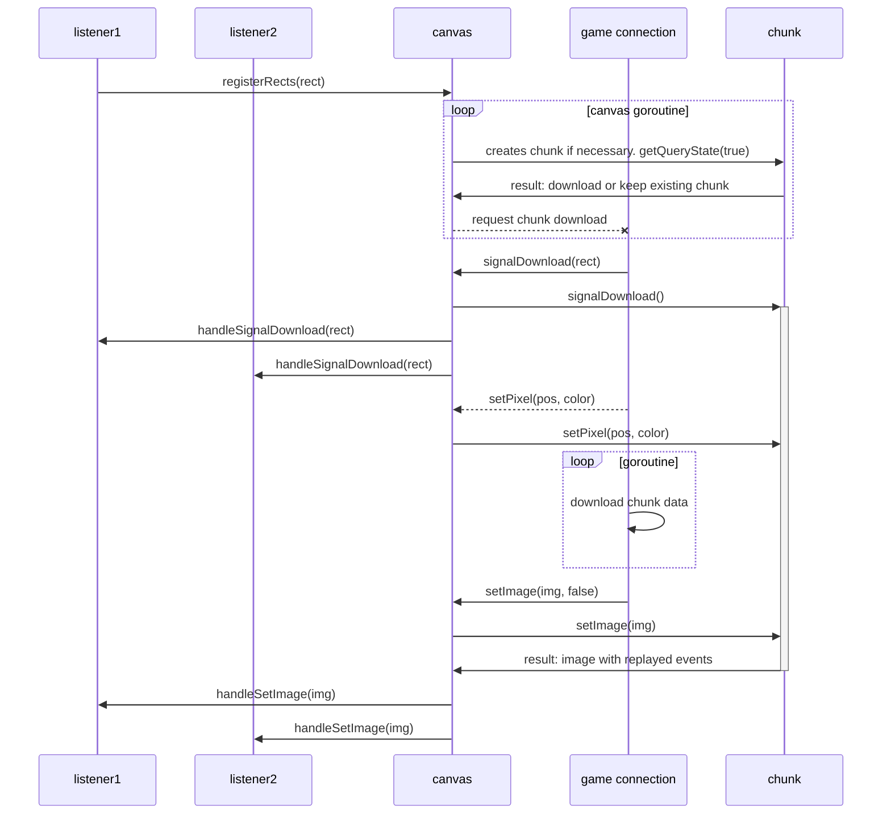

# D3pixelbot internal architecture

## Chunk download mechanism

Each listener can register an unlimited amount of rectangles it wants to listen to.
The canvas periodically queries the chunks based on the rectangles.
Based on the result of each query something of the following will happen:

- If the chunk is invalid, a download request will be sent to the game connection
- If the chunk hasn't been queried in a while, it will be deleted (TODO: or compressed)

While a chunk is downloading, all pixel events will be queued.
After the chunk has been downloaded, all events will be replayed.
This will make sure that the data will not get out of sync while chunk data is being downloaded.

