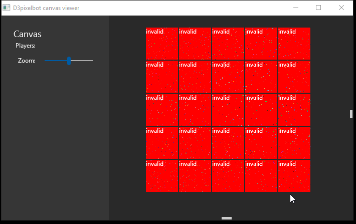

# Freeze example

Steps to reproduce:

1. Start program
2. Click "Open"
3. Use middle mouse button, mouse wheel or arrow keys to scroll in the new window
4. After a few minutes or scrolling, it may freeze

